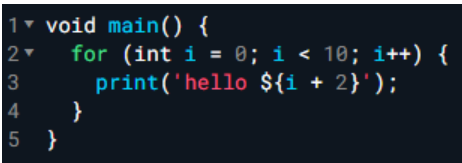
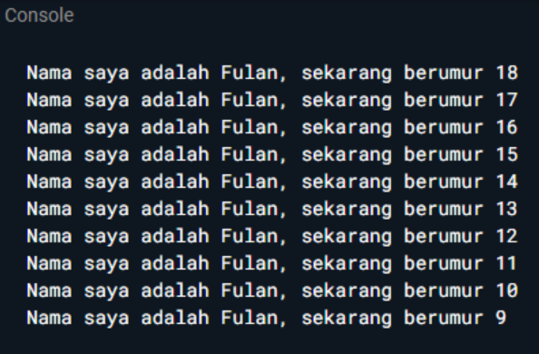
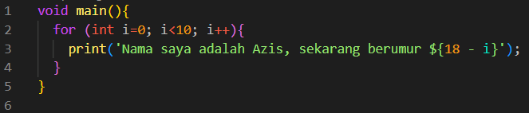
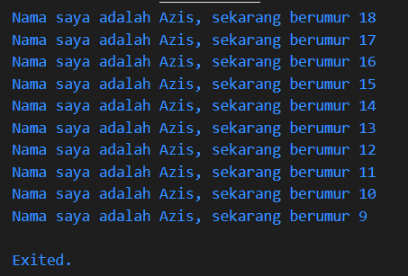

# PERTEMUAN MINGGU 02

NIM : 2141720145

NAMA : Azis ilham kurniawan

TUGAS PRAKTIKUM

# Soal 1 :

Modifikasilah kode pada baris 3 di VS Code atau Editor Code favorit Anda berikut ini agar mendapatkan keluaran (output) sesuai yang diminta!

output yang diminta :

Hasil dari modifikasi dan outputnya :

# Soal 2 :

Mengapa sangat penting untuk memahami bahasa pemrograman Dart sebelum kita menggunakan framework Flutter ? Jelaskan!

Jawab:

Karena Bahasa Dart adalah inti dari framework Flutter. Memahami Dart adalah dasar untuk bekerja dengan Flutter; pengembang perlu mengetahui asal-usul bahasa Dart, bagaimana komunitas mengerjakannya, kelebihannya, dan mengapa itu adalah bahasa pemrograman yang dipilih untuk Flutter.

# Soal 3 :

Rangkumlah materi dari codelab ini menjadi poin-poin penting yang dapat Anda gunakan untuk membantu proses pengembangan aplikasi mobile menggunakan framework Flutter.

Jawab:

- pengenalan tentang dart dan sejarah nya
- kelebihan yang dimiliki dart
- pentingnya untuk mengetahui cara kerja dari dart yang ada pada framework flutter
- pemahaman tentang variabel dan operators pada dart
- bagaimana dart bekerja
- cara penulisan kode sesuai dengan aturan bahasa dart

# Soal 4 :

Buatlah slide yang berisi penjelasan dan contoh eksekusi kode tentang perbedaan Null Safety dan Late variabel ! (Khusus soal ini kelompok berupa link google slide)
