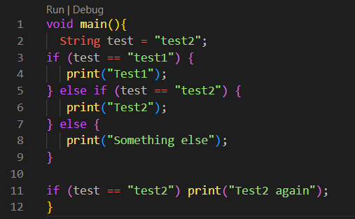
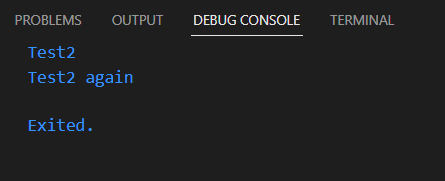
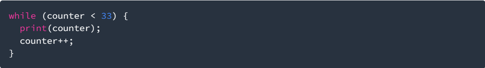
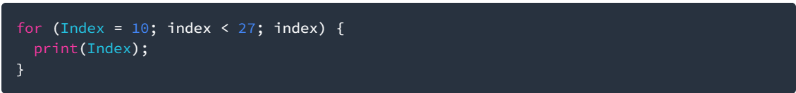

# PERTEMUAN MINGGU 03

NIM : 2141720145

NAMA : Azis ilham kurniawan

**PRAKTIKUM 1:**

LANGKAH 1:

Ketik atau salin kode program berikut ke dalam fungsi main().

LANGKAH 2:

Silakan coba eksekusi (Run) kode pada langkah 1 tersebut. Apa yang terjadi? Jelaskan!

program akan mengeksekusi control flow nya dengan variabel yang sudah dibuat.
jika pilihan dan variabelnya sama maka program akan berhenti dan menampilkan outputnya
dan jika tidak ada maka akan menampilkan pesan lain seperti error.

LANGKAH 3:

Tambahkan kode program berikut, lalu coba eksekusi (Run) kode Anda.

.png>)

Apa yang terjadi ? Jika terjadi error, silakan perbaiki namun tetap menggunakan if/else.

Terjadi error, berikut hasil perbaikan program tadi:

.png>)

hasil outputnya:

.png>)

**PRAKTIKUM 2:**

LANGKAH 1:

Ketik atau salin kode program berikut ke dalam fungsi main().

LANGKAH 2:

Silakan coba eksekusi (Run) kode pada langkah 1 tersebut. Apa yang terjadi? Jelaskan! Lalu perbaiki jika terjadi error.

terjadi error pada langkah 1 karena variabel 'counter' belum dideklarasi dan diinialisasi.
berikut hasil perbaikan dari program di langkah 1:

.png>)

hasil outputnya:

.png>)

LANGKAH 3:
Tambahkan kode program berikut, lalu coba eksekusi (Run) kode Anda.

.png>)

Tidak terjadi error, karena variabel 'counter' sudah dideklarasi dan diinialisasi pada langkah sebelumnya

hasil outputnya:

.png>)

**PRAKTIKUM 3:**

LANGKAH 1:

Ketik atau salin kode program berikut ke dalam fungsi main().

LANGKAH 2:

Silakan coba eksekusi (Run) kode pada langkah 1 tersebut. Apa yang terjadi? Jelaskan! Lalu perbaiki jika terjadi error.

terjadi error karena variabel belum dideklarasi dan diinialisasi.
berikut hasil dari perbaikan program sebelumnya:

.png>)

hasil outputnya:

.png>)

LANGKAH 3:

Tambahkan kode program berikut di dalam for-loop, lalu coba eksekusi (Run) kode Anda.

.png>)

Apa yang terjadi ? Jika terjadi error, silakan perbaiki namun tetap menggunakan for dan break-continue.

Tidak terjadi error, karena variabel sudah dideklarasi dan diinialisasi.
hasil outputnya:

.png>)

**TUGAS PRAKTIKUM**

1. Silakan selesaikan Praktikum 1 sampai 3, lalu dokumentasikan berupa screenshot hasil pekerjaan beserta penjelasannya!
2. Buatlah sebuah program yang dapat menampilkan bilangan prima dari angka 0 sampai 201 menggunakan Dart. Ketika bilangan prima ditemukan, maka tampilkan nama lengkap dan NIM Anda.
3. Kumpulkan berupa link commit repo GitHub pada tautan yang telah disediakan di grup Telegram!

JAWAB:

Buat program yang dapat menampilkan bilangan prima, NIM, dan Nama:

Kode Program:

.png>)

hasil outputnya:

.png>)
.png>)
