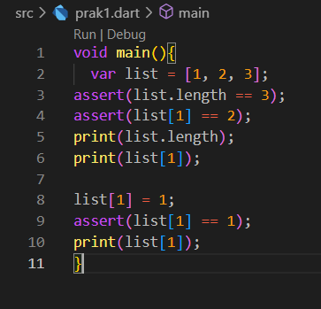
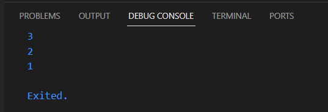
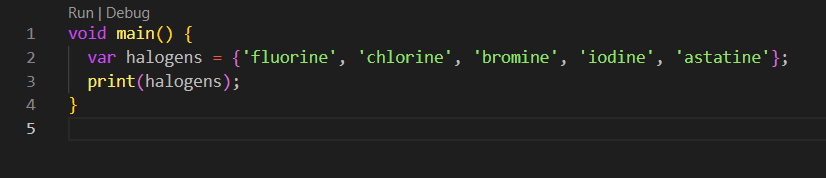
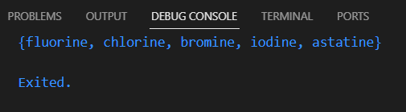

# **PERTEMUAN MINGGU KE-4**

Nama : Azis Ilham Kurniawan

NIM : 2141720145

# PRAKTIKUM 1 : Eksperimen Tipe Data List

**LANGKAH 1**

Ketik atau salin kode program berikut ke dalam void main().

**LANGKAH 2**

Silakan coba eksekusi (Run) kode pada langkah 1 tersebut. Apa yang terjadi? Jelaskan!

**JAWAB:**

Dari hasil eksekusi langkah 1 di atas dihasilkan output di bawah ini:

Pada langkah pertama dari kode di atas, menginisialisasi sebuah list yang berisi tiga index berupa int. Setelah itu, melakukan dua tindakan penting: pertama, memeriksa dan mencetak panjang list serta nilai dari index kedua dalam list tersebut. Kemudian, mengubah nilai index kedua dari list tersebut. Setelah perubahan dilakukan, memeriksa dan mencetak nilai index kedua yang telah diubah.

**LANGKAH 3**

Ubah kode pada langkah 1 menjadi variabel final yang mempunyai index = 5 dengan default value = null. Isilah nama dan NIM Anda pada elemen index ke-1 dan ke-2. Lalu print dan capture hasilnya.

Apa yang terjadi ? Jika terjadi error, silakan perbaiki.

**Kode programnya:**

.png>)

Hasil Outputnya:

.png>)

# PRAKTIKUM 2 : Eksperimen Tipe Data Set

**LANGKAH 1**

Ketik atau salin kode program berikut ke dalam fungsi main().

**LANGKAH 2**

Silakan coba eksekusi (Run) kode pada langkah 1 tersebut. Apa yang terjadi? Jelaskan! Lalu perbaiki jika terjadi error.

**JAWAB:**

Dari hasil eksekusi langkah 1 di atas dihasilkan output di bawah ini:

Kode yang diberikan adalah kode untuk membuat sebuah Set dengan nama "halogens" yang berisi unsur-unsur halogen. Set adalah koleksi yang tidak memiliki indeks, dan unsur-unsur dalam Set tidak memiliki urutan tertentu.

Setiap kali kode ini dijalankan, urutan elemen dalam Set mungkin berbeda-beda karena Set tidak mempertahankan urutan tertentu. Namun, semua elemen yang diberikan dalam Set akan ada dalam output.

**LANGKAH 3**

Tambahkan kode program berikut, lalu coba eksekusi (Run) kode Anda.

.png>)

Apa yang terjadi ? Jika terjadi error, silakan perbaiki namun tetap menggunakan ketiga variabel tersebut. Tambahkan elemen nama dan NIM Anda pada kedua variabel Set tersebut dengan dua fungsi berbeda yaitu .add() dan .addAll(). Untuk variabel Map dihapus, nanti kita coba di praktikum selanjutnya.

Dokumentasikan code dan hasil di console, lalu buat laporannya.

**JAWAB:**

Hasil output dari program di atas :

.png>)

Kemudian saya menambahkan fungsi untuk menambahkan elemen nama dan NIM pada variabel Set: pada kode program diatas hingga menjadi sperti dibawah ini:

.png>)

Dalam kode di atas, menggunakan fungsi .add() untuk menambahkan elemen satu per satu ke names1, dan .addAll() untuk menambahkan elemen dari sebuah Set ke names2. Hasilnya outputnya seperti berikut :

.png>)

# PRAKTIKUM 3 : Eksperimen Tipe Data Maps

**LANGKAH 1**

Ketik atau salin kode program berikut ke dalam fungsi main().

**LANGKAH 2**

Silakan coba eksekusi (Run) kode pada langkah 1 tersebut. Apa yang terjadi? Jelaskan! Lalu perbaiki jika terjadi error.

Saat variabel list ditampilkan, maka akan menyertakan setiap key dan juga value yang dimiliki variabel maps tersebut, variabel dapat berupa String, int, class, maupun objek lain.

**LANGKAH 3**

Tambahkan kode program berikut, lalu coba eksekusi (Run) kode Anda.

.png>)

Apa yang terjadi ? Jika terjadi error, silakan perbaiki.

Tambahkan elemen nama dan NIM Anda pada tiap variabel di atas (gifts, nobleGases, mhs1, dan mhs2). Dokumentasikan hasilnya dan buat laporannya!

Kode program yang sudah diperbaiki:

.png>)

Outputnya :

.png>)

# PRAKTIKUM 4 : Eksperimen Tipe Data List: Spread dan Control-flow Operators

**LANGKAH 1**

Ketik atau salin kode program berikut ke dalam fungsi main().

**LANGKAH 2**

Silakan coba eksekusi (Run) kode pada langkah 1 tersebut. Apa yang terjadi? Jelaskan! Lalu perbaiki jika terjadi error.

**JAWAB:**

Terjadi error karena variabel yang dituju tidak terdefinisi, sehingga dapat diperbaiki dengan varibel yang sudah dideklarasi dan diinisialisasi. Pada kode diatas (...) dapat digunakan untuk menggabungkan nilai pada list dengan nilai pada variabel list lain.

Hasil dari perbaikan kode program yang di atas :

.png>)

Hasil Outputnya :

.png>)

**LANGKAH 3**

Tambahkan kode program berikut, lalu coba eksekusi (Run) kode Anda.

.png>)

Apa yang terjadi ? Jika terjadi error, silakan perbaiki.

Tambahkan variabel list berisi NIM Anda menggunakan Spread Operators. Dokumentasikan hasilnya dan buat laporannya!

**JAWAB:**

Pada error diatas, permasalahannya sama seperti sebelumnya, yaitu varibel yang digunakan belum terdefinisi, sehingga untuk error di atas dapat diperbaiki seperti di bawah ini :

.png>)

Hasil Outputnya :

.png>)

Menambahkan variabel list berisi NIM menggunakan Spread Operators:

.png>)

Hasil Outputnya :

.png>)

**LANGKAH 4**

Tambahkan kode program berikut, lalu coba eksekusi (Run) kode Anda.

.png>)

Apa yang terjadi ? Jika terjadi error, silakan perbaiki. Tunjukkan hasilnya jika variabel promoActive ketika true dan false.

**JAWAB:**

Error terjadi dikarenakan variabel promoActive belum dilakukan deklarasi maupun inisialisasi

Hasil perbaikan dari kode program di atas :

.png>)

.png>)

.png>)

.png>)

Pada program diatas jika promoActive bernilai true maka 'Outlet' akan termasuk kedalam list nav, sedangkan jika promoActive bernilai false, maka 'Outlet' tidak akan termasuk kedalam list nav.

**LANGKAH 5**

Tambahkan kode program berikut, lalu coba eksekusi (Run) kode Anda.

.png>)

Apa yang terjadi ? Jika terjadi error, silakan perbaiki. Tunjukkan hasilnya jika variabel login mempunyai kondisi lain.

**JAWAB:**

Error terjadi dikarenakan variabel promoActive belum dilakukan deklarasi maupun inisialisasi

Hasil dari perbaikan kode program di atas :

.png>)

.png>)

Jika sebelumnya if hanya dapat berupa boolean, sedangkan if case, dapat menggunakan berbagai kondisi

**LANGKAH 6**

Tambahkan kode program berikut, lalu coba eksekusi (Run) kode Anda.

Apa yang terjadi ? Jika terjadi error, silakan perbaiki. Jelaskan manfaat Collection For dan dokumentasikan hasilnya.

**JAWAB:**

Tidak terjadi error pada kode program di atas, Collection for dapat membantu dalam pembuatan data pada list yang memiliki pola yang sama atau berulang, sehingga dengan menggunakan Collection For ini, dapat menyingkat baris program yang digunakan.

# PRAKTIKUM 5 : Eksperimen Tipe Data Records

**LANGKAH 1**

Ketik atau salin kode program berikut ke dalam fungsi main().

**LANGKAH 2**

Silakan coba eksekusi (Run) kode pada langkah 1 tersebut. Apa yang terjadi? Jelaskan! Lalu perbaiki jika terjadi error.

**JAWAB:**

Error terjadi dikarenakan kurangnya simbol semicolon (;), Kode program menampilkan records yang memiliki isi berupa string dan maps atau kombinai antara list dengan maps

hasil dari perbaikan kode program di atas:

**LANGKAH 3**

Tambahkan kode program berikut di luar scope void main(), lalu coba eksekusi (Run) kode Anda.

.png>)

Apa yang terjadi ? Jika terjadi error, silakan perbaiki. Gunakan fungsi tukar() di dalam main() sehingga tampak jelas proses pertukaran value field di dalam Records.

**JAWAB:**

.png>)

Kode Program dapat berjalan dengan baik, dengan fungsi yang mereturn data yang sudah diswap atau tukar, yang sebelumnya (65, 34) menjadi (34, 65)

**LANGKAH 4**

Tambahkan kode program berikut di dalam scope void main(), lalu coba eksekusi (Run) kode Anda.

.png>)

Apa yang terjadi ? Jika terjadi error, silakan perbaiki. Inisialisasi field nama dan NIM Anda pada variabel record mahasiswa di atas. Dokumentasikan hasilnya dan buat laporannya!

**JAWAB:**

Error terjadi dikarenakan variabel yang digunakan belum memiliki value

Hasil dari perbaikan kode program di atas :

.png>)

**LANGKAH 5**

Tambahkan kode program berikut di dalam scope void main(), lalu coba eksekusi (Run) kode Anda.

.png>)

Apa yang terjadi ? Jika terjadi error, silakan perbaiki. Gantilah salah satu isi record dengan nama dan NIM Anda, lalu dokumentasikan hasilnya dan buat laporannya!

**JAWAB:**

Dari kode diatas, dalam mengakses suatu value dalam records, jika yang diakses berupa data non maps, maka dapat menggunakan index nya, yang dimulai dari 1, sedangkan jika value berupa maps, maka untuk memperoleh valuenya maka perlu menggunakan key yang dimiliki maps tersebut.

.png>)

# TUGAS PRAKTIKUM

1. Silakan selesaikan Praktikum 1 sampai 5, lalu dokumentasikan berupa screenshot hasil pekerjaan Anda beserta penjelasannya!
2. Jelaskan yang dimaksud Functions dalam bahasa Dart!
3. Jelaskan jenis-jenis parameter di Functions beserta contoh sintaksnya!
4. Jelaskan maksud Functions sebagai first-class objects beserta contoh sintaknya!
5. Apa itu Anonymous Functions? Jelaskan dan berikan contohnya!
6. Jelaskan perbedaan Lexical scope dan Lexical closures! Berikan contohnya!
7. Jelaskan dengan contoh cara membuat return multiple value di Functions!
8. Kumpulkan berupa link commit repo GitHub pada tautan yang telah disediakan di grup Telegram!

**JAWAB:**

1. Silakan selesaikan Praktikum 1 sampai 5, lalu dokumentasikan berupa screenshot hasil pekerjaan Anda beserta penjelasannya!

2. Jelaskan yang dimaksud Functions dalam bahasa Dart!

    * Functions adalah kumpulan baris kode program yang memiliki tugas atau tujuan tertentu yang dapat digunakan atau dipanggil dengan menggunakan nama function dan parameter jika ada, contohnya untuk function operasi aritmatika, atau contohnya functions main() yang akan dibaca pertama kali saat program dart dijalankan.

3. Jelaskan jenis-jenis parameter di Functions beserta contoh sintaksnya!

    * Named Parameters: Parameter ini digunakan dengan menyebutkan nama variabel parameter saat memanggil fungsi, hal ini dapat dilakukan dengan menambahkan kurung kurawa pada parameter ({}).
    

    * Positional Parameters: Parameter ini digunakan dengan menginputkan parameter sesuai susunannya di parameter function yang dipanggil.
    

    * Default Parameter: Parameter ini memiliki nilai default atau nilai awal pada function, jikalau variabel tersebut ternyata tidak diisi, sehingga variabel yang diberi default value dapat tidak diisi.
    
    

4. Jelaskan maksud Functions sebagai first-class objects beserta contoh sintaknya!

    * Functions sebagai first-class objects ialah menggunakan functions lain untuk menjadi parameter pada functions tertentu.

    

5. Jelaskan maksud Functions sebagai first-class objects beserta contoh sintaknya!

    * Anonymous Functions, juga dikenal sebagai lambda atau closures, adalah fungsi yang tidak memiliki nama. Mereka digunakan untuk mendefinisikan blok kode yang dapat dieksekusi atau disimpan dalam variabel tanpa perlu memberikan nama.

    contoh :

    

6. Jelaskan perbedaan Lexical scope dan Lexical closures! Berikan contohnya!

    * Lexical scope mengacu pada aturan yang menentukan akses ke variabel dan fungsi dalam sebuah blok kode (Penggunaan kurung kurawa) berdasarkan struktur kode secara fisik (lexical). Sedangkan Lexical closures mengacu pada kemampuan sebuah fungsi untuk menyimpan referensi ke variabel-variabel dari lingkup (scope) yang lebih tinggi, bahkan setelah fungsi tersebut telah selesai dieksekusi.

    contoh Lexical scope :

    

    Dari kode program diatas menunjukan, suatu variabel atau fungsi dapat diakses jika berada pada level blok kode program yang sama.

    Contoh Lexical Closure :

    

    Dari kode program diatas, disini saya menggunakan contoh yang sama untuk first class, meskipun function berada di luar functions main, namun functions tersebut masih dapat diakses dalam functions main.

7. Jelaskan dengan contoh cara membuat return multiple value di Functions!

    * Dengan menggunakan records ataupun list memungkinkan functions untuk memberikan return berupa beberapa nilai yang digabungkan menjadi satu.

        a. Untuk pembuatannya dapat dimulai dengan menentukan return value dari functions berupa maps atau list

        b. Kemudian buat parameter (opsional)

        c. Selanjutnya buat suatu operasi kemudian return data sesuai yang ditentukan pada return value functions

        d. Pada main juga diperlukan variabel dengan jumlah yang sama untuk menerima return valu dari functions yang dipanggil.

        contoh kode programnya :

        