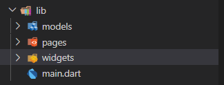
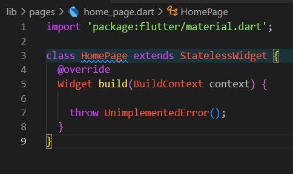
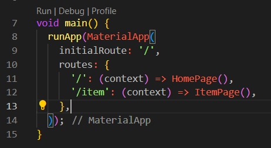
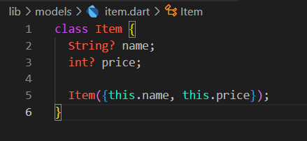
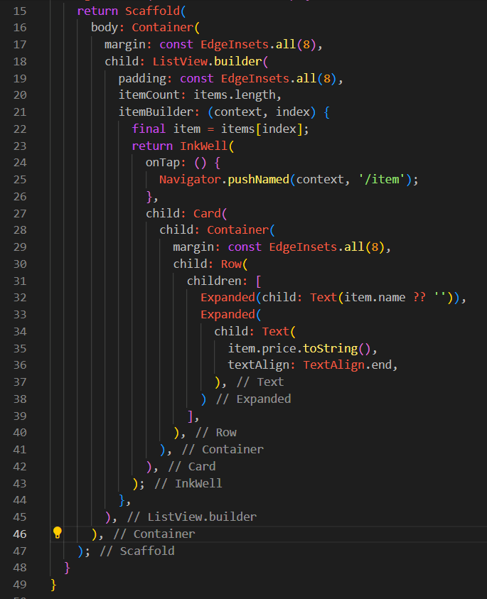
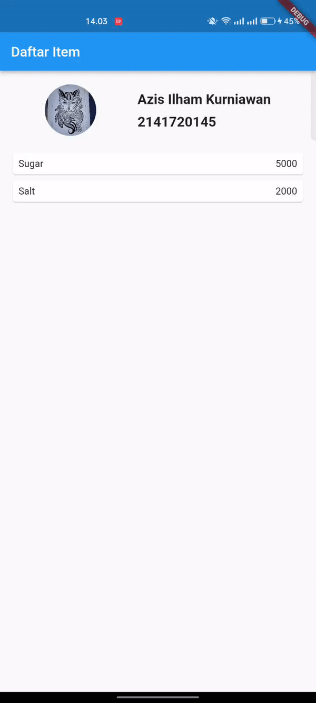
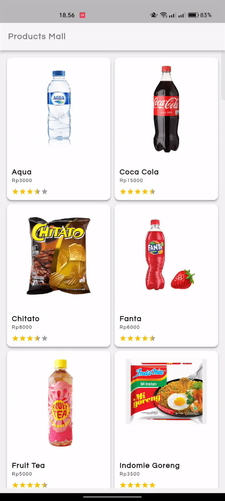

# Praktikum 5: Membangun Navigasi di Flutter

**NAMA : Azis Ilham Kurniawan**
**NIM : 2141720145**

**Langkah 1: Siapkan project baru**

**Langkah 2: Mendefinisikan Route**

    class HomePage extends StatelessWidget {
        @override
        Widget build(BuildContext context) {
            // TODO: implement build
            throw UnimplementError();
        }
    }

**Langkah 3: Lengkapi Kode di main.dart**

    void main() {
        runApp(MaterialApp(
            initialRoute: '/',
            routes: {
                '/': (context) => HomePage(),
                '/item': (context) => ItemPage(),
            },
        )); // MaterialApp
    }

**Langkah 4: Membuat data model : add "?" after String and int.**

    class Item {
        String? name;
        int? price;

        Item({this.name, this.price});
    }

**Langkah 5: Lengkapi kode di class HomePage**

    class HomePage extends StatelessWidget {
        final List<Item> items = [
            Item(name: 'Sugar', price: 5000),
            Item(name: 'Salt', price: 2000)
        ];
    }

**Langkah 6: Membuat ListView dan itemBuilder**

    body: Container(
        margin: EdgeInsets.all(8),
        child: ListView.builder(
            padding: EdgeInsets.all(8),
            itemCount: items.length,
            itemBuilder: (context, index) {
                final item = items[index];
                return Card(
                    child: Container(
                        margin: Row(
                            children: [
                                Expanded(child: Text(item.name?? '')),
                                Expanded(
                                    child: Text(
                                        item.price.toString(),
                                        textAlign: TextAlign.end,
                                    ), // Text
                                ) // Expanded
                            ],
                        ), // Row
                    ), // Container
                ); // Card
            },
        ), // ListView.builder
    ), // Container

**Langkah 7: Menambahkan aksi pada ListView**

    return InkWell(
        onTap: () {
            Navigator.pushNamed(context, '/item');
        },
    )

# Tugas Praktikum 2

1. Untuk melakukan pengiriman data ke halaman berikutnya, cukup menambahkan informasi arguments pada penggunaan *Navigator*. Perbarui kode pada bagian *Navigator* menjadi seperti berikut.

    Navigator.pushNamed(context, '/item', arguments: item);

2. Pembacaan nilai yang dikirimkan pada halaman sebelumnya dapat dilakukan menggunakan *ModalRoute*. Tambahkan kode berikut pada blok fungsi build dalam halaman *ItemPage*. Setelah nilai didapatkan, anda dapat menggunakannya seperti penggunaan variabel pada umumnya.
[(https://docs.flutter.dev/cookbook/navigation/navigate-with-arguments)](https://docs.flutter.dev/cookbook/navigation/navigate-with-arguments)

    final itemArgs = ModalRoute.of(context)!.settings.arguments as Item;

3. Pada hasil akhir dari aplikasi **belanja** yang telah anda selesaikan, tambahkan atribut foto produk, stok, dan rating. Ubahlah tampilan menjadi *GridView* seperti di aplikasi marketplace pada umumnya.

4. Silakan implementasikan *Hero widget* pada aplikasi **belanja** Anda dengan mempelajari dari sumber ini: [(https://docs.flutter.dev/cookbook/navigation/hero-animations)]( https://docs.flutter.dev/cookbook/navigation/hero-animations)

5. Sesuaikan dan modifikasi tampilan sehingga menjadi aplikasi yang menarik. Selain itu, pecah widget menjadi kode yang lebih kecil. Tambahkan **Nama** dan **NIM** di footer aplikasi **belanja** Anda.

6. Selesaikan Praktikum Navigasi dan Rute tersebut, lalu dokumentasikan dan push ke repository Anda berupa screenshot setiap hasil pekerjaan beserta penjelasannya di file *README.md*. Kumpulkan link commit repository GitHub Anda ke spreadsheet yang telah disediakan!

