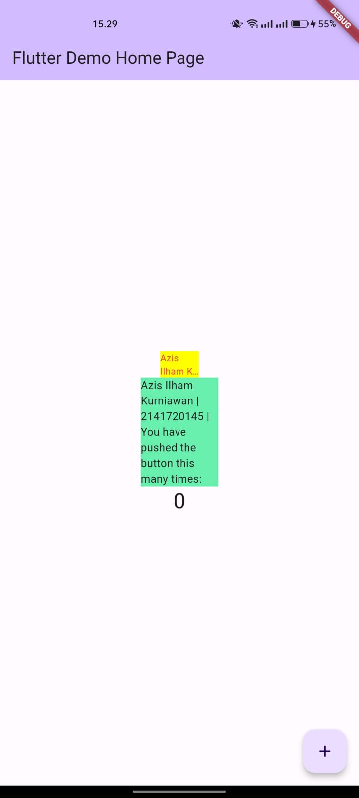

# Nama : Azis Ilham Kurniawan

# Kelas : TI-3F

# Absen : 08

# NIM : 2141720145

# 7. Praktikum Menerapkan Plugin di Project Flutter

**Langkah 2: Menambahkan Plugin**

    flutter pub add auto_size_text

**pakai di terminal**

**Langkah 3: Buat file red_text_widget.dart**

    import 'package:flutter/material.dart';

    class RedTextWidget extends StatelessWidget {
    const RedTextWidget({Key? key}) : super(key: key);

    @override
    Widget build(BuildContext context) {
        return Container();
    }
    }

**Langkah 4: Tambah Widget AutoSizeText**

    return AutoSizeText(
        text,
        style: const TextStyle(color: Colors.red, fontSize: 14),
        maxLines: 2,
        overflow: TextOverflow.ellipsis,
    );

**ganti return Container(); jadi yang di langkah 4**

answer : terjadi eror karena package AutoSizeText belum di import ke main, dan text belum dimasukkan ke container

**Langkah 5: Buat Variabel text dan parameter di constructor**

    final String text;

    const RedTextWidget({Key? key, required this.text}) : super(key: key);

**If you wanted the final form of widget**

    import 'package:auto_size_text/auto_size_text.dart';
    import 'package:flutter/material.dart';

    class RedTextWidget extends StatelessWidget {
    final String text;

    const RedTextWidget({Key? key, required this.text}) : super(key: key);

    @override
    Widget build(BuildContext context) {
        return AutoSizeText(
        text,
        style: const TextStyle(color: Colors.red, fontSize: 14),
        maxLines: 2,
        overflow: TextOverflow.ellipsis,
        );
    }
    }

**Langkah 6: Tambahkan widget di main.dart**

    Container(
    color: Colors.yellowAccent,
    width: 50,
    child: const RedTextWidget(
                text: 'You have pushed the button this many times:',
            ),
    ),
    Container(
        color: Colors.greenAccent,
        width: 100,
        child: const Text(
            'You have pushed the button this many times:',
            ),
    ),

**If you wanted the final form of main dart**

    import 'package:flutter/material.dart';
    import 'package:flutter_plugin_pubdev/widgets/red_text_widget.dart';

    void main() {
    runApp(const MyApp());
    }

    class MyApp extends StatelessWidget {
    const MyApp({super.key});

    // This widget is the root of your application.
    @override
    Widget build(BuildContext context) {
        return MaterialApp(
        title: 'Flutter Demo',
        debugShowCheckedModeBanner: false,
        theme: ThemeData(
            colorScheme: ColorScheme.fromSeed(seedColor: Colors.deepPurple),
            useMaterial3: true,
        ),
        home: const MyHomePage(title: 'Flutter Demo Home Page'),
        );
    }
    }

    class MyHomePage extends StatefulWidget {
    const MyHomePage({super.key, required this.title});

    final String title;

    @override
    State<MyHomePage> createState() => _MyHomePageState();
    }

    class _MyHomePageState extends State<MyHomePage> {
    int _counter = 0;

    void _incrementCounter() {
        setState(() {
        _counter++;
        });
    }

    @override
    Widget build(BuildContext context) {
        return Scaffold(
        appBar: AppBar(
            backgroundColor: Theme.of(context).colorScheme.inversePrimary,
            title: Text(widget.title),
        ),
        body: Center(
            child: Column(
            mainAxisAlignment: MainAxisAlignment.center,
            children: <Widget>[
                Container(
                color: Colors.yellowAccent,
                width: 50,
                child: const RedTextWidget(
                    text: 'You have pushed the button this many times:',
                ),
                ),
                Container(
                color: Colors.greenAccent,
                width: 100,
                child: const Text(
                    'You have pushed the button this many times:',
                ),
                ),
                Text(
                '$_counter',
                style: Theme.of(context).textTheme.headlineMedium,
                ),
            ],
            ),
        ),
        floatingActionButton: FloatingActionButton(
            onPressed: _incrementCounter,
            tooltip: 'Increment',
            child: const Icon(Icons.add),
        ), // This trailing comma makes auto-formatting nicer for build methods.
        );
    }
    }

**Hasil Running**

**Tugas Praktikum**

1. Selesaikan Praktikum tersebut, lalu dokumentasikan dan push ke repository Anda berupa screenshot hasil pekerjaan beserta penjelasannya di file README.md!

2. Jelaskan maksud dari langkah 2 pada praktikum tersebut!

   answer : maksud dari tsb menambahkan plugin auto_size_text yang otomatis ditambahkan ke pubspec.yaml sebagai dependencies

3. Jelaskan maksud dari langkah 5 pada praktikum tersebut!

   answer : teks variabel ditambah ke constructor RedTextWidget dengan String dan itu wajib tidak boleh null agar bisa diganti isinya

4. Pada langkah 6 terdapat dua widget yang ditambahkan, jelaskan fungsi dan perbedaannya!

   answer : fungsi dari tersebut menampilkan text di container. Perbedaan pada di warna, width, dan child

5. Jelaskan maksud dari tiap parameter yang ada di dalam plugin auto_size_text berdasarkan tautan pada dokumentasi [ini](https://pub.dev/documentation/auto_size_text/latest/) !

answer :

| Parameter           | Description                                                                                                           |
| ------------------- | --------------------------------------------------------------------------------------------------------------------- |
| Key \*              | mengidentifikasi widget dalam widget tree flutter                                                                     |
| textKey             | Key yang bisa digunakan untuk mengidentifikasi teks.                                                                  |
| style \*            | Menentukan gaya teks, termasuk properti-properti seperti ukuran font, warna, dll.                                     |
| minFontSize         | Ukuran font minimum yang akan digunakan saat melakukan penyesuaian otomatis ukuran teks                               |
| maxFontSiz          | Ukuran font maksimum yang akan digunakan saat melakukan penyesuaian otomatis ukuran teks                              |
| stepGranularity     | digunakan saat menyesuaikan ukuran teks                                                                               |
| presentFontSizes    | digunakan dalam penyesuaian ukuran teks                                                                               |
| group               | Digunakan untuk mengelompokkan beberapa widget AutoSizeText bersama untuk menyesuaikan ukuran teks mereka bersamaan   |
| textAlign \*        | Menentukan perataan teks seperti 'left', 'center', 'right', dan sebagainya                                            |
| textDirection \*    | Menentukan arah teks seperti 'ltr' (kiri ke kanan) atau 'rtl' (kanan ke kiri)                                         |
| locale \*           | Menentukan bahasa atau lokasi untuk penulisan teks                                                                    |
| softWrap \*         | Menentukan apakah teks akan dilipat secara otomatis ke baris berikutnya jika tidak cukup ruang                        |
| wrapWords           | Menentukan apakah kata-kata akan dibungkus ke baris berikutnya jika tidak cukup ruang                                 |
| overflow \*         | Menentukan perilaku teks saat tidak cukup ruang, misalnya 'ellipsis' akan menampilkan titik-titik jika teks terpotong |
| overflowReplacement | Widget alternatif yang akan ditampilkan sebagai pengganti teks yang terpotong                                         |
| textScaleFactor \*  | Faktor skala yang digunakan untuk memperbesar atau mengecilkan teks                                                   |
| maxLines            | Jumlah maksimum baris teks yang akan ditampilkan                                                                      |
| semanticLabel \*    | digunakan untuk aksesibilitas atau pembaca layar                                                                      |

#
