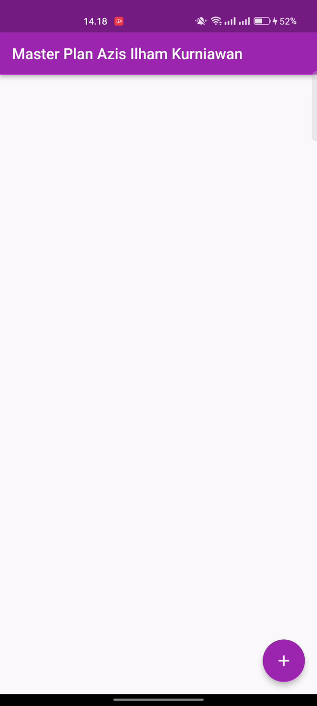

# Nama : Azis Ilham Kurniawan

# NIM : 2141720145

# Kelas : TI - 3F

 

# Praktikum 1 : Dasar State dengan Model-View

### 1. Selesaikan langkah-langkah praktikum tersebut, lalu dokumentasikan berupa GIF hasil akhir praktikum beserta penjelasannya di file README.md!

> Selesai ✅

### 2. Jelaskan maksud dari langkah 4 pada praktikum tersebut! Mengapa dilakukan demikian?

> Dengan mengimpor berkas data_layer.dart, berkas-berkas plan.dart dan task.dart akan menjadi terjangkau dan dapat digunakan dalam berkas lain tanpa perlu mengimpor keduanya secara terpisah. Ini membantu membuat kode menjadi lebih rapi dan ringkas karena Anda hanya perlu mengimpor satu berkas (data_layer.dart) untuk mendapatkan akses ke dua berkas tersebut, daripada mengimpor keduanya secara terpisah.

### 3. Mengapa perlu variabel plan di langkah 6 pada praktikum tersebut? Mengapa dibuat konstanta ?

> Variabel `plan` digunakan untuk menyimpan instance dari model `Plan`, memungkinkan akses ke data rencana. Mendeklarasikannya sebagai konstanta (`const`) menjaga konsistensi nilainya selama siklus hidup widget `PlanScreen`, menghindari perubahan yang tidak diinginkan pada objek `plan`.

### 4. Lakukan capture hasil dari Langkah 9 berupa GIF, kemudian jelaskan apa yang telah Anda buat!

> Hasil Capture berada dibawah

### 5. Apa kegunaan method pada Langkah 11 dan 13 dalam lifecyle state ?

> Langkah 11 (Method `initState()`) digunakan untuk menginisialisasi objek `scrollController` dan menghapus fokus dari elemen input saat pengguna menggulir halaman.

> Langkah 13 (Method `dispose()`) digunakan untuk membersihkan sumber daya, di mana Anda melepaskan objek `scrollController` agar tidak menyebabkan masalah memori atau sumber daya ketika widget tidak lagi digunakan.

- Hasil Akhir Praktikum 1

> 

- Penjelasan : Output diatas adalah hasil running dari praktikum 1 yaitu memahami Dasar State dengan Model-View untuk membuat list penjadwalan.

---

 
 
