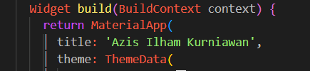

#### NAMA: Azis Ilham Kurniawan

#### NIM: 2141720145

#### Kelas: TI - 3F

## Praktikum 1

### Hasil Praktikum 1

> 

**Soal 1**
- Tambahkan nama panggilan Anda pada title app sebagai identitas hasil pekerjaan Anda.

    > 

**Soal 2**
- Carilah judul buku favorit Anda di Google Books, lalu ganti ID buku pada variabel path di kode tersebut. Caranya ambil di URL browser Anda seperti gambar berikut ini.

    > .png)

- Kemudian cobalah akses di browser URI tersebut dengan lengkap seperti ini. Jika menampilkan data JSON, maka Anda telah berhasil. Lakukan capture milik Anda dan tulis di README pada laporan praktikum.

    > .png)

**Soal 3**
- Jelaskan maksud kode langkah 5 tersebut terkait substring dan catchError!

> Substring, yang merupakan bagian string yang dimulai dari indeks tertentu dan berakhir pada indeks tertentu, diambil dari string melalui substring(). Metode ini memiliki dua parameter: indeks awal dan indeks akhir. Indeks awal berfungsi sebagai indeks karakter pertama yang diinginkan, dan indeks akhir berfungsi sebagai indeks karakter terakhir yang diinginkan. substring() digunakan oleh kode di atas untuk mengambil 450 karakter pertama dari respons API; metode catchError() menangani kesalahan dan menerima satu parameter, yaitu fungsi yang akan dijalankan jika terjadi kesalahan. Jika terjadi kesalahan saat mengambil respons API, kode tersebut akan menggunakan catchError() untuk menampilkan pesan kesalahan dengan judul "An error occurred".

- Capture hasil praktikum Anda berupa GIF dan lampirkan di README.

> Selesai.

## Praktikum 2

### Hasil Praktikum 2

> 

**Soal 4**
- Jelaskan maksud kode langkah 1 dan 2 tersebut!

> Kode Dart, yang terletak pada langkah pertama dari kode di atas, memiliki tiga fungsi return Async: returnOneAsync, returnTwoAsync, dan returnThreeAsync. Ketiga fungsi ini mengembalikan nilai int, dan Future.delayed() memperlambat eksekusi selama tiga detik. Masing-masing fungsi digambarkan sebagai berikut:
   - returnOneAsync() Fungsi ini mengembalikan nilai 1 setelah 3 detik.
   - returnTwoAsync() Fungsi ini mengembalikan nilai 2 setelah 3 detik.
   - returnThreeAsync() Fungsi ini mengembalikan nilai 3 setelah 3 detik.

> Fungsi returnOneAsync(), returnTwoAsync(), dan returnThreeAsync() digunakan untuk menghitung jumlah dari tiga fungsi asynchronous lainnya dalam langkah kedua dari kode di atas. Jika Anda menggunakan fungsi count(), yang mengembalikan Future, eksekusinya tidak akan memblokir kode lainnya.

- Capture hasil praktikum Anda berupa GIF dan lampirkan di README. Lalu lakukan commit dengan pesan "W12: Soal 4".

> Selesai.

## Praktikum 3

### Hasil Praktikum 3

> 

**Soal 5**
- Jelaskan maksud kode langkah 2 tersebut!
> Variabel completer: Variabel late dari tipe Completer, variabel ini digunakan untuk menyimpan hasil perhitungan angka 42. Method  getNumber() mengembalikan nilai dari variabel completer dalam dua langkah: pertama, mengaktifkan variabel completer dengan nilai baru; kedua, memanggil metode calculate() untuk menghitung angka 42. Metode calculate() menggunakan Future.delayed() untuk menunggu 5 detik sebelum menghitung angka 42.

- Capture hasil praktikum Anda berupa GIF dan lampirkan di README. Lalu lakukan commit dengan pesan "W12: Soal 5".
> Selesai.

**Soal 6**
- Jelaskan maksud perbedaan kode langkah 2 dengan langkah 5-6 tersebut!
> Pada langkah 5, kita mengubah isi dari method calculate(). Sebelumnya, metode ini menggunakan await Future.delayed(const Duration(seconds: 5)); untuk menunggu 5 detik untuk menyelesaikan perhitungan angka 42. Namun, metode ini tidak menangani kesalahan yang mungkin terjadi saat menunggu 5 detik. Sebaliknya, kode ini menggunakan try/catch untuk menangani kesalahan yang mungkin terjadi saat menunggu 5 detik. Jika tidak ada kesalahan, metode ini akan menggunakan metode completer.complete() untuk menyelesaikan perhitungan dan mengembalikan nilai 42 ke variabel completer. Jika ada kesalahan, metode ini akan menggunakan metode completer.completeError() untuk menyelesaikan perhitungan dan mengembalikan nilai {} ke variabel completer.

> Pada langkah 6, kita mengubah kode di metode onPressed(). Sebelumnya, metode ini menggunakan then() untuk menangani hasil dari method getNumber. Namun, kode ini menggunakan then() dan catchError untuk menangani kesalahan yang mungkin terjadi saat memanggil method getNumber. Metode ini akan memanggil metode setState() untuk memperbarui state widget dan menampilkan pesan kesalahan jika tidak terjadi kesalahan.

- Capture hasil praktikum Anda berupa GIF dan lampirkan di README. Lalu lakukan commit dengan pesan "W12: Soal 6".
> Selesai.

## Praktikum 4

### Hasil Praktikum 4

> 

## Praktikum 5

### Hasil Praktikum 5

## Praktikum 6

### Hasil Praktikum 6

## Praktikum 7

### Hasil Praktikum 7

## Praktikum 8

### Hasil Praktikum 8

