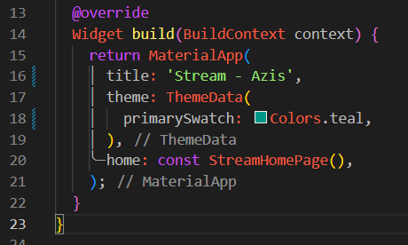

#### Nama: Azis Ilham Kurniawan

#### NIM: 2141720145

#### Kelas: TI - 3F

# Praktikum 1

### Hasil Praktikum

### Soal

**Soal 1**

- Tambahkan nama panggilan Anda pada title app sebagai identitas hasil pekerjaan Anda.
> 
- Gantilah warna tema aplikasi sesuai kesukaan Anda.
> 
- Lakukan commit hasil jawaban Soal 1 dengan pesan "W13: Jawaban Soal 1"
> Selesai

**Soal 2**

- Tambahkan 5 warna lainnya sesuai keinginan Anda pada variabel colors tersebut.
> 
- Lakukan commit hasil jawaban Soal 2 dengan pesan "W13: Jawaban Soal 2"
> Selesai

**Soal 3**

- Jelaskan fungsi keyword yield* pada kode tersebut!
> Keyword yield* memiliki fungsi untuk menghasilkan nilai dari stream Stream.periodic, sedangkan Keyword yield* juga dapat menghasilkan nilai dari stream lain atau iterable.
- Apa maksud isi perintah kode tersebut?
> Isi perintah kode ini adalah untuk membuat Stream warna yang berubah setiap satu detik. Ini dilakukan dengan menghasilkan nilai dari stream Stream.periodic, yang menghasilkan nilai integer setiap detik, yang kemudian digunakan untuk menentukan indeks warna.
- Lakukan commit hasil jawaban Soal 3 dengan pesan "W13: Jawaban Soal 3"
> Selesai

**Soal 4**

- Capture hasil praktikum Anda berupa GIF dan lampirkan di README.
> Selesai
- Lakukan commit hasil jawaban Soal 4 dengan pesan "W13: Jawaban Soal 4"
> Selesai