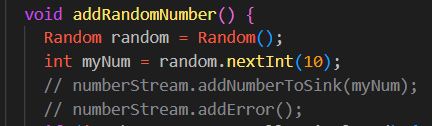
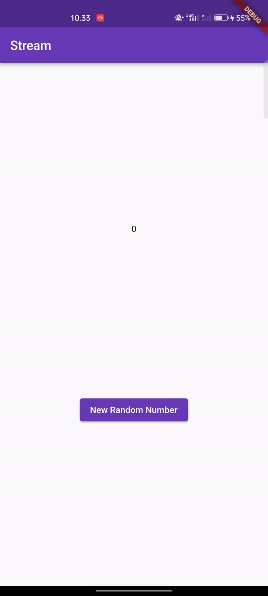

#### Nama: Azis Ilham Kurniawan

#### NIM: 2141720145

#### Kelas: TI - 3F

# Praktikum 1

### Hasil Praktikum

### Soal

**Soal 1**

- Tambahkan nama panggilan Anda pada title app sebagai identitas hasil pekerjaan Anda.
> 
- Gantilah warna tema aplikasi sesuai kesukaan Anda.
> 
- Lakukan commit hasil jawaban Soal 1 dengan pesan "W13: Jawaban Soal 1"
> Selesai

**Soal 2**

- Tambahkan 5 warna lainnya sesuai keinginan Anda pada variabel colors tersebut.
> 
- Lakukan commit hasil jawaban Soal 2 dengan pesan "W13: Jawaban Soal 2"
> Selesai

**Soal 3**

- Jelaskan fungsi keyword yield* pada kode tersebut!
> Keyword yield* memiliki fungsi untuk menghasilkan nilai dari stream Stream.periodic, sedangkan Keyword yield* juga dapat menghasilkan nilai dari stream lain atau iterable.
- Apa maksud isi perintah kode tersebut?
> Isi perintah kode ini adalah untuk membuat Stream warna yang berubah setiap satu detik. Ini dilakukan dengan menghasilkan nilai dari stream Stream.periodic, yang menghasilkan nilai integer setiap detik, yang kemudian digunakan untuk menentukan indeks warna.
- Lakukan commit hasil jawaban Soal 3 dengan pesan "W13: Jawaban Soal 3"
> Selesai

**Soal 4**

- Capture hasil praktikum Anda berupa GIF dan lampirkan di README.
> Selesai
- Lakukan commit hasil jawaban Soal 4 dengan pesan "W13: Jawaban Soal 4"
> Selesai

**Soal 5**

- Jelaskan perbedaan menggunakan listen dan await for (langkah 9) !
> Listen:
 1. Sifat Sinkron-Asinkron: Metode listen bersifat asinkron, artinya program dapat melanjutkan ke baris kode berikutnya tanpa menunggu pengiriman data ke stream selesai. 

 2. Pengendalian Fleksibel: Metode mendengarkan memungkinkan eksekusi program untuk memilih pengendali fungsi yang akan dijalankan setiap kali ada perubahan pada aliran. 

 3. Non-bloking: Jika metode mendengarkan digunakan, program dapat melanjutkan ke baris kode berikutnya tanpa harus menunggu pengiriman data ke stream selesai.

> Await for:
 1. Sifat Sinkron: Metode menunggu adalah sinkron, yang berarti eksekusi program akan menunggu hingga data tersedia di aliran sebelum melanjutkan ke baris kode berikutnya.

 2. Penggunaan Iterator: Menunggu untuk mendapatkan nilai dari aliran berbeda dengan menggunakan iterator.

 3. Blokasi: Dengan menggunakan await for, eksekusi program akan diblokir sampai data tersedia di aliran atau aliran ditutup.

- Lakukan commit hasil jawaban Soal 5 dengan pesan "W13: Jawaban Soal 5"
> Selesai

# Praktikum 2

### Hasil Praktikum

.gif)

**Soal 6**

- Jelaskan maksud kode langkah 8 dan 10 tersebut!
> Langkah 8: Saat widget pertama kali dibuat, metode initState() dipanggil. Pada langkah ini, kode membuat dua objek: objek    NumberStream dan objek StreamController. Objek StreamController menangani aliran data yang dikeluarkan oleh NumberStream. Aliran kemudian didengarkan, dan metode setState() digunakan setiap kali peristiwa baru dikeluarkan. Ini melakukan pekerjaannya untuk memastikan bahwa widget diperbarui setiap kali menerima nomor terbaru.

> Langkah 10 : Metode addRandomNumber() membuat objek Random dan kemudian memanggil metode nextInt() untuk mendapatkan nomor acak antara 0 dan 9, kemudian metode addNumberToSink() digunakan untuk menambahkan nomor acak ke aliran data.
- Capture hasil praktikum Anda berupa GIF dan lampirkan di README.
> Selesai
- Lalu lakukan commit dengan pesan "W13: Jawaban Soal 6".
> Selesai

**Soal 7**

- Jelaskan maksud kode langkah 13 sampai 15 tersebut!
> Langkah 13 adalah menambah metode addError() ke kelas Stream. Metode ini memungkinkan penambahan error ke stream.

> Langkah 15 adalah memodifikasi metode addRandomNumber(). Kita kemudian membahas dua baris kode yang digunakan untuk menambahkan angka acak ke aliran, dan kemudian menambahkan kode baru untuk menambahkan error ke aliran.
- Kembalikan kode seperti semula pada Langkah 15, comment addError() agar Anda dapat melanjutkan ke praktikum 3 berikutnya.
> 
- Lalu lakukan commit dengan pesan "W13: Jawaban Soal 7".
> Selesai

#### Hasil modifikasi praktikum 2

.gif)

# Praktikum 3

### Hasil Praktikum

**Soal 8**

- Jelaskan maksud kode langkah 1-3 tersebut!
> Langkah 1: Memasukkan variabel transformasi ke dalam class _StreamHomePageState. Variabel ini akan digunakan untuk menyimpan objek transformasi angin.

> Langkah 2: Tambahkan kode untuk membuat objek StreamTransformer. Ini akan mengubah data yang diterima dari aliran. Dalam kasus ini, data akan diubah menjadi integer yang dikalikan dengan 10.

> Langkah 3: Menambah kode untuk mengedit kode di initState(). Ini akan menggunakan objek transformer untuk mengubah data yang diterima dari stream.
- Capture hasil praktikum Anda berupa GIF dan lampirkan di README.
> Selesai
- Lalu lakukan commit dengan pesan "W13: Jawaban Soal 8".
> Selesai