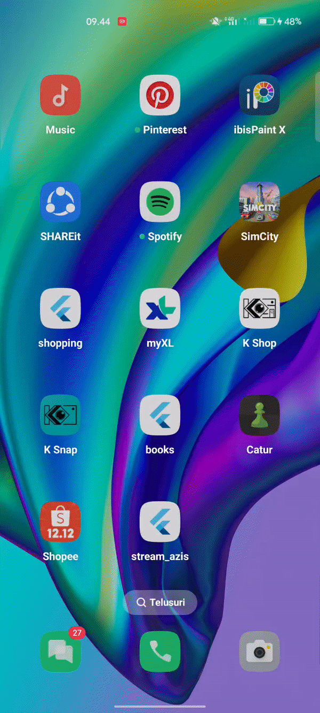
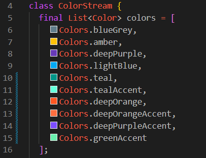
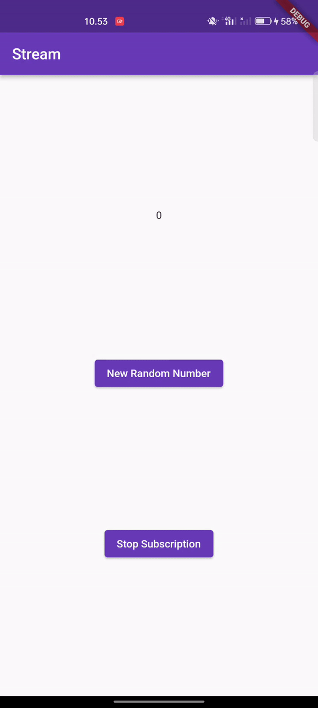
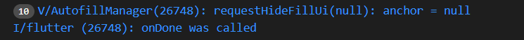
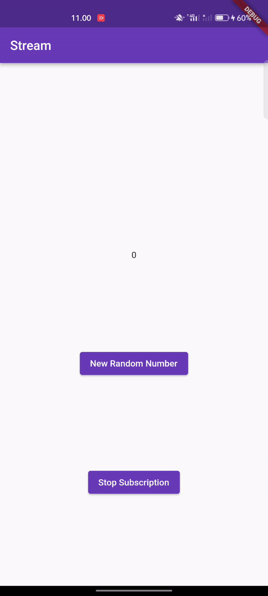
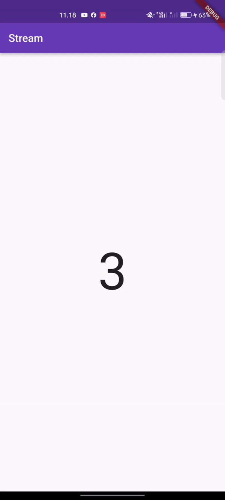
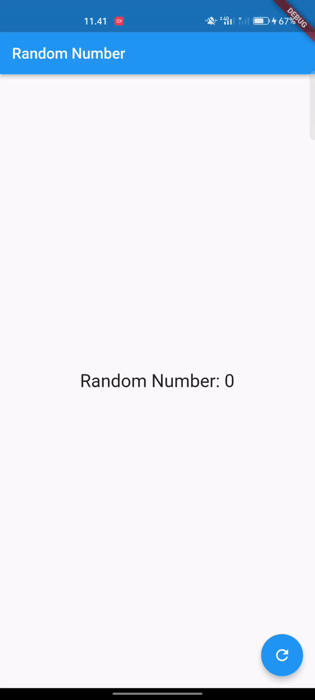

#### Nama: Azis Ilham Kurniawan

#### NIM: 2141720145

#### Kelas: TI - 3F

# Praktikum 1

### Hasil Praktikum

### Soal

**Soal 1**

- Tambahkan nama panggilan Anda pada title app sebagai identitas hasil pekerjaan Anda.
> 
- Gantilah warna tema aplikasi sesuai kesukaan Anda.
> 
- Lakukan commit hasil jawaban Soal 1 dengan pesan "W13: Jawaban Soal 1"
> Selesai

**Soal 2**

- Tambahkan 5 warna lainnya sesuai keinginan Anda pada variabel colors tersebut.
> 
- Lakukan commit hasil jawaban Soal 2 dengan pesan "W13: Jawaban Soal 2"
> Selesai

**Soal 3**

- Jelaskan fungsi keyword yield* pada kode tersebut!
> Keyword yield* memiliki fungsi untuk menghasilkan nilai dari stream Stream.periodic, sedangkan Keyword yield* juga dapat menghasilkan nilai dari stream lain atau iterable.
- Apa maksud isi perintah kode tersebut?
> Isi perintah kode ini adalah untuk membuat Stream warna yang berubah setiap satu detik. Ini dilakukan dengan menghasilkan nilai dari stream Stream.periodic, yang menghasilkan nilai integer setiap detik, yang kemudian digunakan untuk menentukan indeks warna.
- Lakukan commit hasil jawaban Soal 3 dengan pesan "W13: Jawaban Soal 3"
> Selesai

**Soal 4**

- Capture hasil praktikum Anda berupa GIF dan lampirkan di README.
> Selesai
- Lakukan commit hasil jawaban Soal 4 dengan pesan "W13: Jawaban Soal 4"
> Selesai

**Soal 5**

- Jelaskan perbedaan menggunakan listen dan await for (langkah 9) !
> Listen:
 1. Sifat Sinkron-Asinkron: Metode listen bersifat asinkron, artinya program dapat melanjutkan ke baris kode berikutnya tanpa menunggu pengiriman data ke stream selesai. 

 2. Pengendalian Fleksibel: Metode mendengarkan memungkinkan eksekusi program untuk memilih pengendali fungsi yang akan dijalankan setiap kali ada perubahan pada aliran. 

 3. Non-bloking: Jika metode mendengarkan digunakan, program dapat melanjutkan ke baris kode berikutnya tanpa harus menunggu pengiriman data ke stream selesai.

> Await for:
 1. Sifat Sinkron: Metode menunggu adalah sinkron, yang berarti eksekusi program akan menunggu hingga data tersedia di aliran sebelum melanjutkan ke baris kode berikutnya.

 2. Penggunaan Iterator: Menunggu untuk mendapatkan nilai dari aliran berbeda dengan menggunakan iterator.

 3. Blokasi: Dengan menggunakan await for, eksekusi program akan diblokir sampai data tersedia di aliran atau aliran ditutup.

- Lakukan commit hasil jawaban Soal 5 dengan pesan "W13: Jawaban Soal 5"
> Selesai

# Praktikum 2

### Hasil Praktikum

.gif)

**Soal 6**

- Jelaskan maksud kode langkah 8 dan 10 tersebut!
> Langkah 8: Saat widget pertama kali dibuat, metode initState() dipanggil. Pada langkah ini, kode membuat dua objek: objek    NumberStream dan objek StreamController. Objek StreamController menangani aliran data yang dikeluarkan oleh NumberStream. Aliran kemudian didengarkan, dan metode setState() digunakan setiap kali peristiwa baru dikeluarkan. Ini melakukan pekerjaannya untuk memastikan bahwa widget diperbarui setiap kali menerima nomor terbaru.

> Langkah 10 : Metode addRandomNumber() membuat objek Random dan kemudian memanggil metode nextInt() untuk mendapatkan nomor acak antara 0 dan 9, kemudian metode addNumberToSink() digunakan untuk menambahkan nomor acak ke aliran data.
- Capture hasil praktikum Anda berupa GIF dan lampirkan di README.
> Selesai
- Lalu lakukan commit dengan pesan "W13: Jawaban Soal 6".
> Selesai

**Soal 7**

- Jelaskan maksud kode langkah 13 sampai 15 tersebut!
> Langkah 13 adalah menambah metode addError() ke kelas Stream. Metode ini memungkinkan penambahan error ke stream.

> Langkah 15 adalah memodifikasi metode addRandomNumber(). Kita kemudian membahas dua baris kode yang digunakan untuk menambahkan angka acak ke aliran, dan kemudian menambahkan kode baru untuk menambahkan error ke aliran.
- Kembalikan kode seperti semula pada Langkah 15, comment addError() agar Anda dapat melanjutkan ke praktikum 3 berikutnya.
> 
- Lalu lakukan commit dengan pesan "W13: Jawaban Soal 7".
> Selesai

#### Hasil modifikasi praktikum 2

.gif)

# Praktikum 3

### Hasil Praktikum

**Soal 8**

- Jelaskan maksud kode langkah 1-3 tersebut!
> Langkah 1: Memasukkan variabel transformasi ke dalam class _StreamHomePageState. Variabel ini akan digunakan untuk menyimpan objek transformasi angin.

> Langkah 2: Tambahkan kode untuk membuat objek StreamTransformer. Ini akan mengubah data yang diterima dari aliran. Dalam kasus ini, data akan diubah menjadi integer yang dikalikan dengan 10.

> Langkah 3: Menambah kode untuk mengedit kode di initState(). Ini akan menggunakan objek transformer untuk mengubah data yang diterima dari stream.
- Capture hasil praktikum Anda berupa GIF dan lampirkan di README.
> Selesai
- Lalu lakukan commit dengan pesan "W13: Jawaban Soal 8".
> Selesai

# Praktikum 4

### Hasil Praktikum

**Soal 9**

- Jelaskan maksud kode langkah 2, 6 dan 8 tersebut!
> Langkah 2: Masukkan kode yang akan membuat objek NumberStream dan NumberStreamController. Objek NumberStream akan menghasilkan stream integer secara acak, dan objek NumberStreamController akan mengontrol stream tersebut.

> Langkah 6: Memasukkan kode pembatalan subscription di dispose(). Ini dilakukan untuk mencegah hilangnya memori.

> Langkah 8: Melibatkan penambahan kode untuk menentukan apakah aliran telah ditutup sebelum menambahkan data. Jika aliran telah ditutup, nilai variabel lastNumber akan diubah menjadi nilai -1.
- Capture hasil praktikum Anda berupa GIF dan lampirkan di README.
> Selesai
- Lalu lakukan commit dengan pesan "W13: Jawaban Soal 9".
> Selesai

#### Hasil dari menekan button ‘Stop Subscription'

# Praktikum 5

### Hasil Praktikum

**Soal 10**

- Jelaskan mengapa error itu bisa terjadi ?
> Kesalahan ini terjadi ketika mencoba menambahkan atau membuat dua langganan pada stream yang sama tanpa membatalkan langganan sebelumnya. Ini terjadi ketika inisialisasi langganan2 pada metode initState(), karena inisialisasi langganan sudah ada untuk menangani stream yang sama pada saat yang sama.

**Soal 11**

- Jelaskan mengapa hal itu bisa terjadi ?
> Dua angka acak yang sama akan dihasilkan saat Anda menekan tombol "New Random Number". Angka-angka tersebut berasal dari aliran yang disebut oleh objek aliran dan aliran2. Aliran akan mengembalikan nilai berupa peristiwa (angka acak) yang dipisahkan dengan tanda "-". Saat tombol "Stop Stream" ditekan, aliran akan menghentikan langganan aliran terhadap aliran, sehingga aliran tidak lagi dapat mengeluarkan output meskipun menekan tombol "New Random Number".
- Capture hasil praktikum Anda berupa GIF dan lampirkan di README.
> Selesai
- Lalu lakukan commit dengan pesan "W13: Jawaban Soal 10,11".
> Selesai

# Praktikum 6

### Hasil Praktikum

**Soal 12**

- Jelaskan maksud kode pada langkah 3 dan 7 !
> Langkah 3:
Metode getNumber menggunakan Stream.periodic untuk membuat aliran bilangan bulat dalam waktu 1 detik. Sebuah bilangan acak antara 0 dan 9 dibuat menggunakan Random, dan kemudian dikirimkan ke aliran dengan bantuan yield* async* untuk menghasilkan aliran dari nilai-nilai yang diberikan.

> Langkah 7:
Untuk membuat sebuah widget, StreamBuilder menggunakan data dari numberStream, yang dihasilkan dari getNumber() pada NumberStream. Selama ada snapshot.hasData, widget akan menampilkan teks yang mengandung nilai data tersebut. Kita hanya mencetak pesan "Error!" tanpa menampilkan konten apa pun jika terjadi error; jika tidak ada data, kita kembalikan widget yang tidak terlihat. Ini memungkinkan tampilan untuk mengubah data yang diterima dari aliran dan membuat tampilan yang sesuai dengan kondisi aliran.
- Capture hasil praktikum Anda berupa GIF dan lampirkan di README.
> Selesai
- Lalu lakukan commit dengan pesan "W13: Jawaban Soal 12".
> Selesai

# Praktikum 7

### Hasil Praktikum

**Soal 13**

- Jelaskan maksud praktikum ini ! Dimanakah letak konsep pola BLoC-nya ?
> jawaban: Dua StreamController dimiliki oleh RandomNumberBloc pada random_bloc. _generateRandomController berfungsi sebagai penerima perintah untuk menghasilkan angka acak, dan _randomNumberController mengirimkan angka acak ke tampilan UI. Saat _generateRandomController menerima trigger atau event, blok tersebut memproses event tersebut menggunakan Random().

> Pada file random_screen, RandomScreen menampilkan angka acak yang diterima dari RandomNumberBloc. Kemudian, RandomScreen menggunakan StreamBuilder untuk membangun tampilan yang terhubung ke stream _bloc.randomNumber. Ini memungkinkan UI secara otomatis diperbarui ketika ada perubahan data di dalam stream, sehingga teks dengan angka acak selalu terupdate sesuai dengan nilai terbaru yang diterima dari stream. Proses pengacakan angka dimulai dengan tombol Action Floating. Setelah menekan tombol ini, onPressed akan mengirimkan perintah melalui generateRandom.add(null) ke _generateRandomController pada BLoC. Ini akan memulai pembuatan angka acak dan mengirimkannya kembali ke UI melalui stream. 
- Capture hasil praktikum Anda berupa GIF dan lampirkan di README.
> Selesai
- Lalu lakukan commit dengan pesan "W13: Jawaban Soal 13".
> Selesai